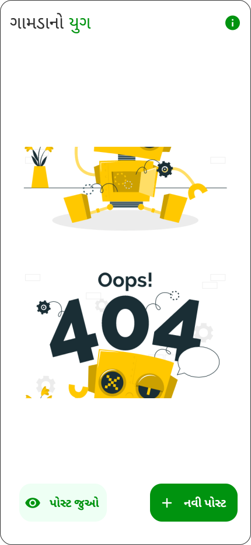

# Village Era - Empowering Villagers with Technology

Welcome to Village Era, a groundbreaking application built using Java libraries such as Lottie and TensorFlow Lite. Village Era is a powerful tool designed to support villagers, allowing them to voice their complaints, suggestions, and advice, ultimately fostering a more cohesive and prosperous community.

## Key Features:

### Villager Support:

Village Era grants every villager the right to make posts regarding their concerns, complaints, or valuable suggestions. This inclusive platform enables villagers to share their opinions and contribute to the betterment of their village.

### Sarpanch Empowerment:

The Sarpanch, as the village head, plays a crucial role in the administration. With Village Era, the Sarpanch gains the ability to view all the posts made by villagers, stay updated on their needs, and respond promptly to their concerns. Additionally, the Sarpanch can effortlessly issue village-wide notices, ensuring effective communication with the entire community.

## Installation:

To utilize the powerful features of Village Era, you need to install TensorFlow Lite. Head to the official TensorFlow website [here](https://www.tensorflow.org/) and follow the installation instructions to get started.

## App Flow:

1. **Onboarding Screen:**

Upon launching the app for the first time, users will be greeted with an informative onboarding screen, providing an introduction to the app's features and functionality.

2. **Login and Authentication:**

Village Era prioritizes user security and privacy. Only authorized users, such as the Sarpanch, can access the app's administrative functions. The provided `SignIn` method ensures a secure login process for approved users.

3. **Dashboard:**

Upon successful login, the user is directed to the app's dashboard. The dashboard serves as a hub for all activities, displaying posts, notices, and administrative options.

4. **Post Creation:**

Villagers can create posts detailing their concerns, suggestions, or advice. Village Era encourages open dialogue and constructive discussions among community members.

5. **View Post:**

The app provides a dedicated section to view all the posts made by villagers. This comprehensive view enables the Sarpanch to understand the community's needs and address them effectively.

## Important Instructions:

- The Sarpanch must log in to access the administrative functionalities.
- TensorFlow Lite must be installed to leverage the app's advanced capabilities.

## Reference Code:

For user authentication, the provided `SignIn` method offers a robust and secure login process. Village Era prioritizes user privacy and data protection.

## Screenshots:

To enhance user experience, Village Era features a visually appealing interface. The following images showcase the app's various screens and functionalities:

## Conclusion:

Village Era is more than just an app; it's a revolutionary platform connecting villagers and empowering the Sarpanch to create a harmonious and thriving community. By embracing technology, Village Era brings transparency, communication, and progress to the heart of rural life.

*Empower your village with Village Era today!*
